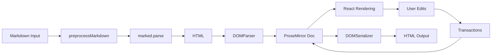

WebEditor is a modern rich text editor built on ProseMirror, combining powerful document modeling with React components for a flexible editing experience.

## Core architecture

WebEditor is built on three foundational technologies:

<CardGroup cols={3}>
  <Card title="ProseMirror" icon="file-code">
    Document model and editing engine
  </Card>
  <Card title="React" icon="atom">
    UI components and rendering
  </Card>
  <Card title="Markdown" icon="markdown">
    Input format and serialization
  </Card>
</CardGroup>

### ProseMirror foundation

At its core, WebEditor uses ProseMirror's document model to represent content as a structured tree rather than HTML. This provides:

- **Schema-based validation** - Every node and mark is defined in the schema
- **Transactions** - All changes are atomic and can be undone/redone
- **Plugins** - Extensible behavior through ProseMirror's plugin system
- **State management** - Immutable state with predictable updates

```tsx title="~/workspace/source/packages/webeditor/src/editor/index.tsx:323-343"
useEffect(() => {
  if (props.value !== undefined) {
    const fragment = props.value.length > 0 ? mdxLikeToProseMirror(props.value) : Fragment.empty;
    const topNode = schema.topNodeType.create(null, fragment);

    const newState = EditorState.create({
      schema,
      doc: topNode,
      plugins,
    });

    setEditorState(newState);
  } else {
    // Handle case where value is undefined (reset to empty state)
    const newState = EditorState.create({
      schema,
      plugins,
    });
    setEditorState(newState);
  }
}, [props.value, plugins]);
```

### React integration

WebEditor uses `@handlewithcare/react-prosemirror` to bridge ProseMirror and React, enabling:

- **Custom node views** - React components for complex nodes like cards and tabs
- **State synchronization** - React state tied to ProseMirror state
- **Event handling** - React event handlers for interactive components

```tsx title="Example node views registration"
nodeViews={{
  card: CardNodeView,
  tabs: TabsNodeView,
  callout: CalloutNodeView,
  code_snippet: CodeSnippetNodeView,
  break: BreakNodeView,
  badge: BadgeNodeView,
  icon: IconNodeView,
  step: StepNodeView,
  accordion: AccordionNodeView,
  columns: ColumnsNodeView,
  column: ColumnNodeView,
  foo: FooNodeView,
  mermaid: MermaidNodeView,
  field: FieldNodeView,
  frame: FrameNodeView,
}}
```

## Schema system

The schema defines what content is allowed in the editor. WebEditor extends ProseMirror's markdown schema with custom nodes and marks.

### Node types

Nodes represent block-level content:

<Accordion title="Standard nodes">
  - `paragraph` - Text paragraphs
  - `heading` - Headings (levels 1-6)
  - `bullet_list` - Unordered lists
  - `ordered_list` - Ordered lists
  - `blockquote` - Quote blocks
</Accordion>

<Accordion title="Custom component nodes">
  - `card` - Card components with titles and icons
  - `tabs` - Tabbed content interfaces
  - `callout` - Info/warning/error callouts
  - `code_snippet` - Syntax-highlighted code blocks
  - `accordion` - Collapsible sections
  - `columns` - Multi-column layouts
  - `badge` - Inline badges
  - `icon` - Lucide icons
  - `step` - Step-by-step instructions
  - `mermaid` - Mermaid diagrams
  - `field` - Parameter documentation
  - `frame` - Content frames with captions
</Accordion>

### Mark types

Marks represent inline formatting:

- `strong` - Bold text
- `em` - Italic text
- `code` - Inline code
- `strikethrough` - Strikethrough text
- `tooltip_mark` - Tooltip annotations

```tsx title="~/workspace/source/packages/webeditor/src/editor/schema.ts:36-79"
const marks = mdSchema.spec.marks
  .append({
    strikethrough: {
      inclusive: false,
      parseDOM: [
        { tag: "s" },
        { tag: "del" },
        { tag: "strike" },
        {
          style: "text-decoration",
          getAttrs: (value: string | Node) => {
            return typeof value === "string" && value.includes("line-through") ? {} : false;
          },
        },
      ],
      toDOM: () => ["s", 0],
    },
  })
  .append({
    tooltip_mark: {
      attrs: {
        tooltip: { default: "" },
      },
      inclusive: false,
      parseDOM: [
        {
          tag: "span[data-tooltip]",
          getAttrs: (dom) => ({
            tooltip: (dom as HTMLElement).getAttribute("data-tooltip") || "",
          }),
        },
      ],
      toDOM: (mark) => [
        "span",
        {
          "data-tooltip": mark.attrs.tooltip,
          class:
            "underline decoration-dotted decoration-muted-foreground cursor-help hover:decoration-foreground transition-colors relative group",
        },
        0,
      ],
    },
  });
```

## Plugin system

WebEditor uses ProseMirror plugins for editor behavior:

<Tabs>
  <Tab title="History">
    Undo/redo functionality using `prosemirror-history`:
    ```tsx
    history()
    ```
  </Tab>
  <Tab title="Keymaps">
    Custom keyboard shortcuts for commands and menu triggers:
    ```tsx
    keymapPlugin({
      "Mod-z": undo,
      "Mod-r": redo,
      "/": (state, _dispatch, view) => {
        // Open command menu
      },
    })
    ```
  </Tab>
  <Tab title="Input rules">
    Markdown-style input patterns for quick formatting:
    ```tsx
    inputPlugin() // Handles ##, **, ~~, etc.
    ```
  </Tab>
  <Tab title="Custom plugins">
    Custom behavior like tooltip click handling and paste processing:
    ```tsx
    createTooltipClickPlugin({
      onTooltipClick: (tooltipText, from, to) => {
        // Edit tooltip
      },
    })
    ```
  </Tab>
</Tabs>

## Document flow

Understanding how content moves through WebEditor:



<Steps>
  <Step title="Input processing">
    Markdown content is preprocessed to handle frontmatter and code blocks, then parsed to HTML using marked.js
  </Step>
  <Step title="DOM parsing">
    HTML is converted to a ProseMirror document using the schema's DOM parser
  </Step>
  <Step title="Rendering">
    React components render the document tree with custom node views for complex components
  </Step>
  <Step title="Editing">
    User interactions create transactions that update the document immutably
  </Step>
  <Step title="Output">
    The document is serialized back to HTML for storage or display
  </Step>
</Steps>

## State management

WebEditor maintains several layers of state:

<Note>
The editor uses React state for UI (menus, dialogs) and ProseMirror state for document content, keeping concerns separated.
</Note>

- **ProseMirror EditorState** - The document content and selection
- **React component state** - UI state for menus, modals, and controls
- **Theme state** - Light/dark mode preferences
- **Plugin state** - History stack, custom plugin data

## Next steps

<CardGroup cols={2}>
  <Card title="Markdown & JSX" href="/concepts/markdown-jsx" icon="markdown">
    Learn how markdown is parsed and JSX components are handled
  </Card>
  <Card title="Components" href="/concepts/components" icon="blocks">
    Explore the component system and command menu
  </Card>
  <Card title="Marks" href="/concepts/marks" icon="highlighter">
    Understand text formatting and the marks menu
  </Card>
  <Card title="Theme system" href="/concepts/theme-system" icon="palette">
    Configure light, dark, and auto theme modes
  </Card>
</CardGroup>